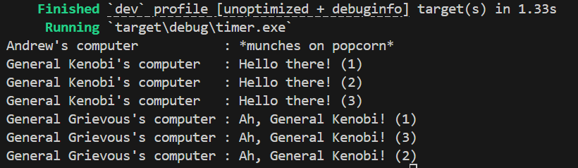
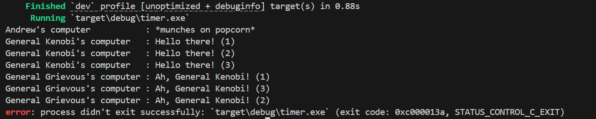

# Module-10-AsynchrounousProgramming-Timer
adpro stuff

## Result after adding println!() after spawn :
> 
> The result was that the added line was printed first. Then general Kenobi's line, and 5 seconds later, general Grievous'. This happens because when spawn happens, it is not executed immediately, but waits for an executor to execute it. The added line was run before the executor and so, it was printed first. Then, the spawned function is executed, printing general Kenobi's line, waiting 5 seconds, and lastly, general Grievous' line.

## Result after spawning three times
> 
> When spawning the async function three times, the result was as such. Andrew's line, general Kenobi's line printed three times, and after 5 seconds of waiting, general Grievous' line printed three times. This happens because of the await. When the executor was called, there are three functions in the queue. The first one is called. It prints general Kenobi's line, then it awaits, so execution is put on hold. Because of the await, it doesn't block the executor from executing other functions in the queue, so it switches to the second one. prints, awaits, switches to the third one, prints, awaits. 5 seconds after the first await was called, it can be continued to run, so it finishes with general Grievous' line, then the second, and then the third.

## Result after removing drop(spawner) :
> 
> the await part is the same as before, but in here when drop(spawner) is removed, the executor still waits for a function that might come from the spawner. Because of that, the program doesn't stop, and i had to stop it manually with ctrl+C. drop(spawner) tells the executor that there will be no more functions coming, and so after it finishes executing all available tasks, it shuts down.