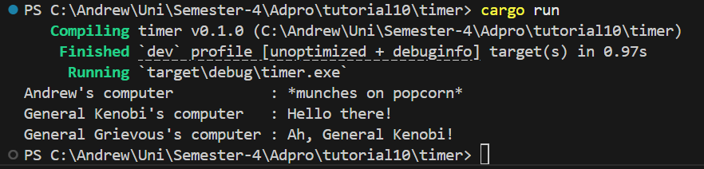

# Module-10-AsynchrounousProgramming-Timer
adpro stuff

## Result after adding println!() after spawn :
> 
> The result was that the added line was printed first. Then general Kenobi's line, and 5 seconds later, general Grievous'. This happens because when spawn happens, it is not executed immediately, but waits for an executor to execute it. The added line was run before the executor and so, it was printed first. Then, the spawned function is executed, printing general Kenobi's line, waiting 5 seconds, and lastly, general Grievous' line.